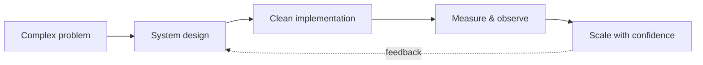
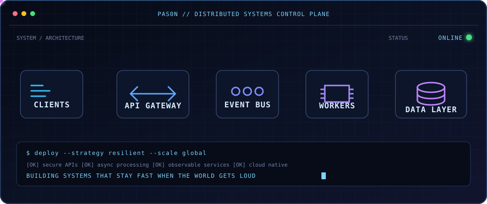

<div align="center">


[](https://git.io/typing-svg)

<p>
  <a href="mailto:pason.dev@gmail.com"></a>
  <a href="https://www.linkedin.com/in/Pasonnn/"></a>
  <a href="https://github.com/Pasonnn"></a>
  
</p>

```text
📍 Ho Chi Minh City, Vietnam  ·  🧠 Backend & distributed systems  ·  ☁️ Cloud-native engineering
```

</div>

## `> whoami`

Software Engineer focused on **secure, scalable, and performance-oriented systems** — happiest when designing reliable backends, optimizing complex workflows, and collaborating across teams.



## `> experience.log`

| Timeline | Role | Company |
| :-- | :-- | :-- |
| **Jan 2026 — Present** | Software Engineer | Netcompany |
| **Sep 2025 — Dec 2025** | Back-End Developer Intern | Vietnam Silicon |
| **Aug 2025 — Oct 2025** | Blockchain Developer Intern | Arps Cyclone |
| **Feb 2025 — Apr 2025** | Blockchain Developer Intern | Be Earning JSC |

## `> toolchain.manifest`

<div align="center">

### Languages & frameworks


### Data, messaging & AI


### Cloud & DevOps


</div>

## `> education --timeline`

| Timeline | Degree | University |
| :-- | :-- | :-- |
| **Aug 2026 — Present** | M.Sc. Computer Science | Ho Chi Minh City University of Technology |
| **Aug 2022 — Apr 2026** | B.Sc. (Hons) Computing · First Class Honours | University of Greenwich |

## `> ./run-engineering-console`

<div align="center">
  
</div>

## `> github --signal`

<div align="center">

### Watch the contribution trail come alive

<picture>
  <source media="(prefers-color-scheme: dark)" srcset="https://raw.githubusercontent.com/Pasonnn/Pasonnn/output/github-contribution-grid-snake-dark.svg">
  
</picture>

### Let's build something exceptional.


</div>
